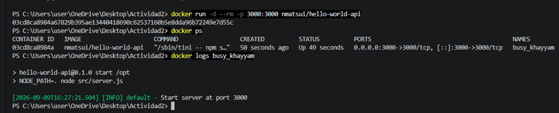
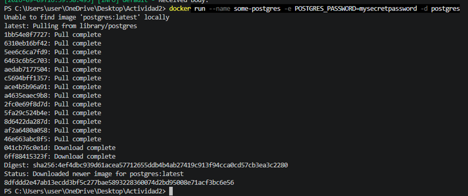
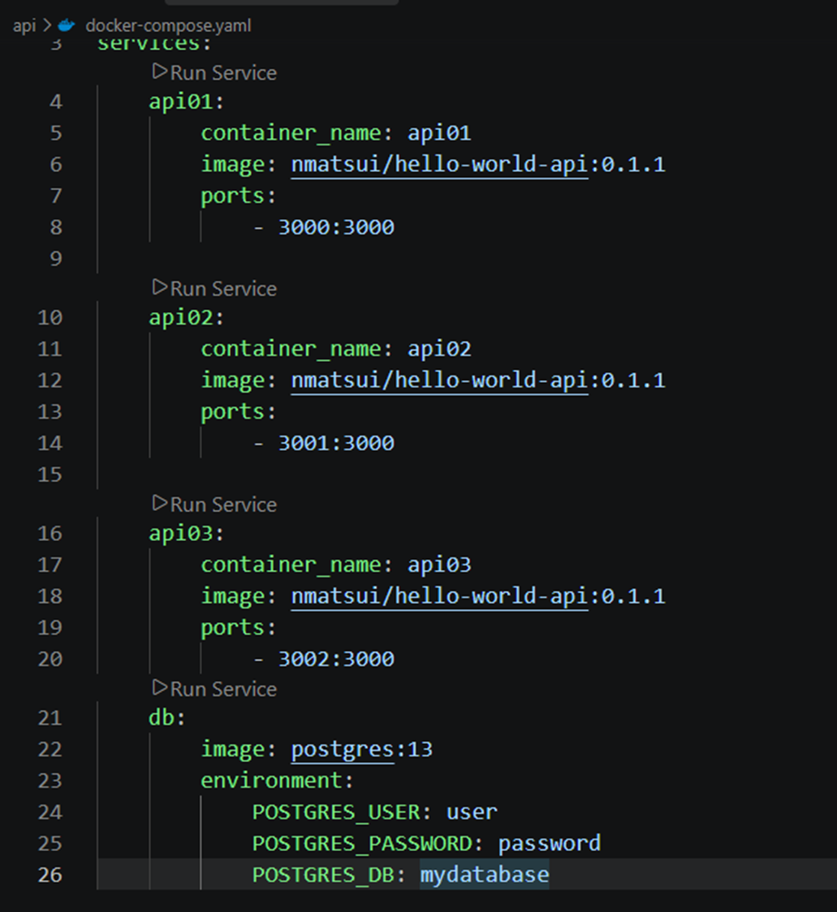
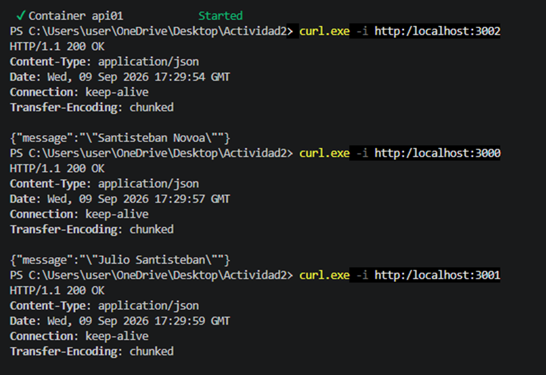
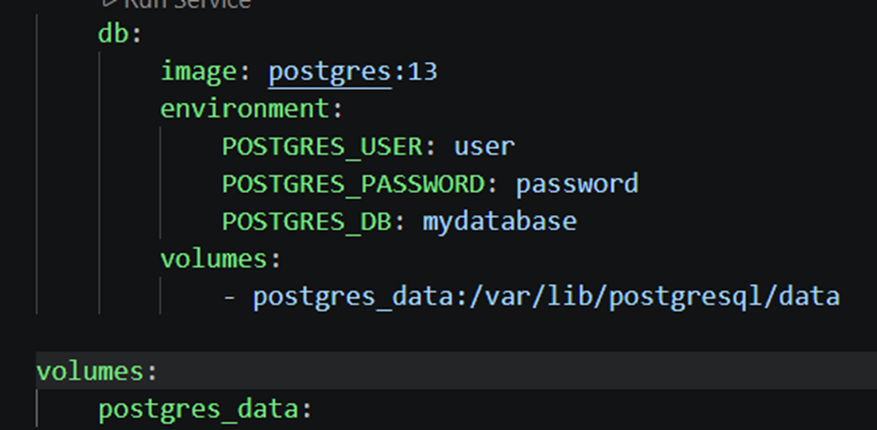
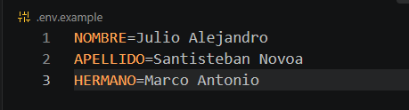
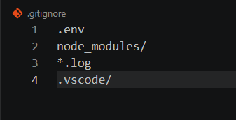

SANTISTEBAN NOVOA JULIO ALEJANDRO

# Tipos de redes en Docker

- Host
    En este tipo el contenedor usa directamente la red de la computadora
-IPvlan
    Trabaja principalmente usando direcciones IP
-Overlay
    Este tipo permite conectar contendores que estan en diferentes computadoras
-Macvlan
    Hace que el contenedor aparezca en la red como si fuera otro equipo
-Bridge
    Es la red mas usada porque permite que varios contenedores se comuniquen dentro de la misma computadora
-None
    El contenedor no tiene conexion a red, entonces se usa cuando se quiere el contenedor aislado

# Tipos de volumenes en Docker

- Named Volume
    Es el volumen donde nosotros le damos un nombre y docker se encarga de guardar los datos
- Ananymous Volume
    Es un volumen creado automaticamente por docker y no tiene un nombre elegido por nosotros
- Bind mount
    Este tipo de volumen nos permite usar carpetas de nuestra computadora dentro de un contenedor
- tmpfs
    Guarda los da tos de forma temporal en la memoria de la computadora, donde se pierden cuando el contenedor se detiene

CAPTURAS DE PANTALLA DE LO TRABAJADO:

