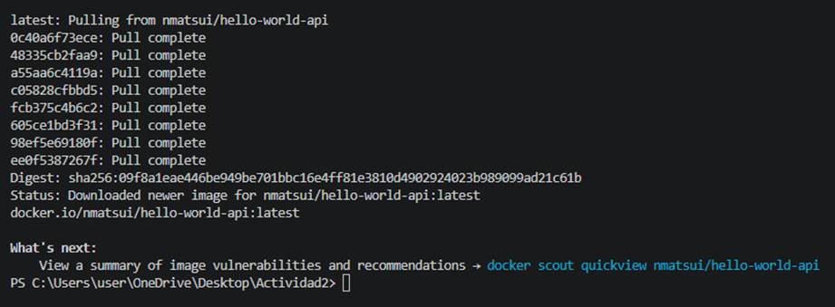
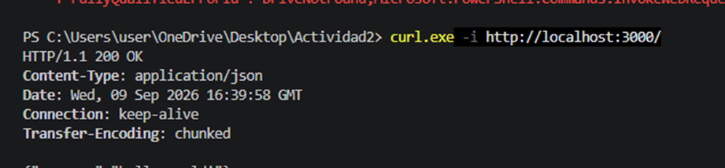
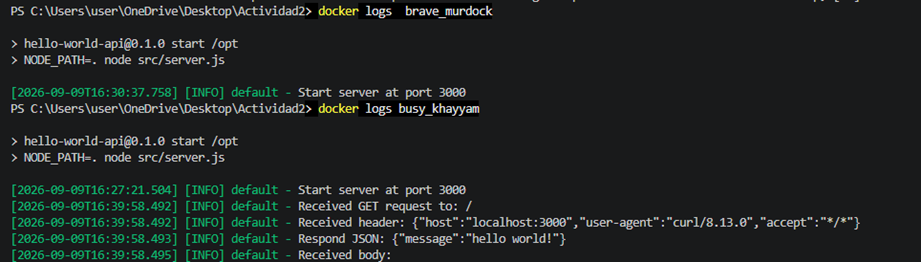
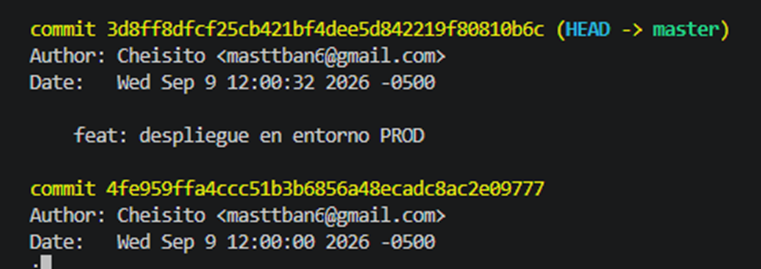
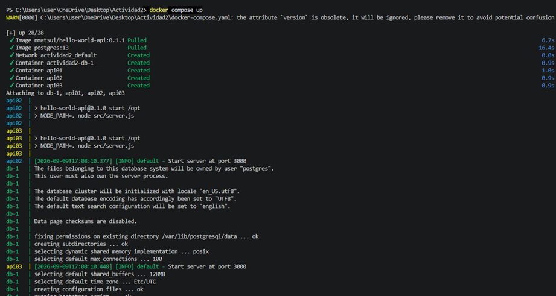
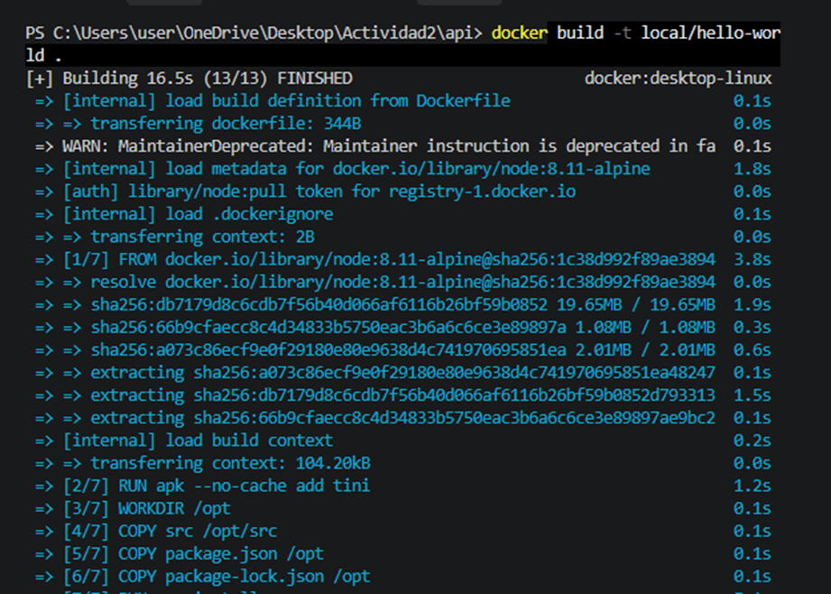
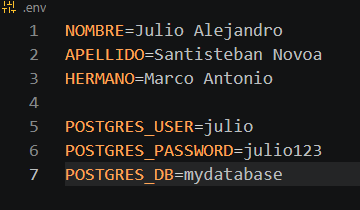
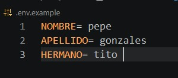
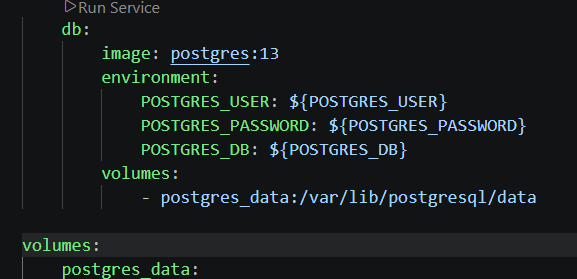

SANTISTEBAN NOVOA JULIO ALEJANDRO

# Tipos de redes en Docker

- Host
    En este tipo el contenedor usa directamente la red de la computadora
-IPvlan
    Trabaja principalmente usando direcciones IP
-Overlay
    Este tipo permite conectar contendores que estan en diferentes computadoras
-Macvlan
    Hace que el contenedor aparezca en la red como si fuera otro equipo
-Bridge
    Es la red mas usada porque permite que varios contenedores se comuniquen dentro de la misma computadora
-None
    El contenedor no tiene conexion a red, entonces se usa cuando se quiere el contenedor aislado

# Tipos de volumenes en Docker

- Named Volume
    Es el volumen donde nosotros le damos un nombre y docker se encarga de guardar los datos
- Ananymous Volume
    Es un volumen creado automaticamente por docker y no tiene un nombre elegido por nosotros
- Bind mount
    Este tipo de volumen nos permite usar carpetas de nuestra computadora dentro de un contenedor
- tmpfs
    Guarda los da tos de forma temporal en la memoria de la computadora, donde se pierden cuando el contenedor se detiene

CAPTURAS DE PANTALLA DE LO TRABAJADO:

Despues se realizo cambios en .env.example para poner solo datos de prueba, despues de realizar las variables que se ocultaran por gitignore
aparte se cambio las variables en la parte del readme.

